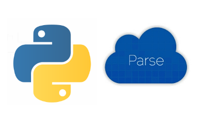

#Work In Progress

[](https://travis-ci.org/nghiattran/python-parse)
[](https://coveralls.io/github/nghiattran/python-parse?branch=master)

#Python-parse
    Python API template for backend system using parse.com as database.

[](https://github.com/nghiattran/python-parse) 

[Roadmap](https://github.com/nghiattran/python-parse#road-map)&nbsp;&nbsp;&nbsp;
[Getting Started](https://github.com/nghiattran/python-parse#getting-started)&nbsp;&nbsp;&nbsp;
[API architecture](https://github.com/nghiattran/python-parse#api-architecture)&nbsp;&nbsp;&nbsp;
[How to ](https://github.com/nghiattran/python-parse#how-to-use)&nbsp;&nbsp;&nbsp;

#Road map

List of planning features:

- [x] Limit request per IP
- [x] Limit request per interval of time
- [x] Email automation
- [ ] Update documentation
- [x] Social network integration
- [ ] Remove unused dependencies

# Getting started

###Installation
    
    # install all dependencies
    bin/install
 
###Start
    
    # start redis
    bin/start_redis
    #start api in port 8000
    bin/start
    
###Testing
    
    # run normal tests
    bin/test
    # or run a specific test file
    bin/test path/to/file

    # not available yet
    # run mock tests
    bin/mock
    # or run a specific mock test file
    bin/mock path/to/file

    # run coverage
    bin/cover

    # clean up
    bin/clean

#API architecture

    bin
        \- install                          # install all dependencies
        \- start_redis                      # start redis
        \- start                            # start service   
        \- test                             # run live tests
        \- mock                             # run mock tests (in future)
        \- cover                            # run coverage
        \- clean                            # clean coverage
    app.py                                  # create app and set routes
    src
        \- controllers                      
            \- __init__                     # set up controllers and their associates
            \- user_controller.py           # controller to handle user data
        \- forms
            \- __init__                     # set up base form
            \- user_form.py                 # form to handle user data
        \- models
            \- __init__                     # set up base model
            \- user_model.py                # model to handle user data
        \- utils
            \- __init__                     # utility functions
    test
        \- live                             # branch for live tests
            \- integration                  # branch for integration test
                \- test_user.py             # tests for user_controller

#How to use

###Open an API endpoint

Example: open `/users` endpoint.

####1/ Create `<endpoint_name>_form.py` in this case `user_form.py`:
This file plays as a filter for incomming data.

``` python
from wtforms import\
    StringField,\
    HiddenField,
from src.forms import \
    BaseGetForm,

class UserGetForm(BaseGetForm):
    username = StringField()
    password = HiddenField()
```

`BaseGetForm` is for filtering `limit`, `count`, `keys`, . . .

All accessible data need to be placed in`UserGetForm` or will be ignored. As in this case only `username` and `password` are included.

####2/ Create `<endpoint_name>_model.py` in this case `user_model.py`:
This file is adding headers and sending requests to Parse.com.

``` python
from src.models.authentication_model import \
    generate_auth_token
from src.models import BaseModel

class UserModel(BaseModel):
    _parse_class_name = '_User'

    def user_signup(self, payload):
        res = self.signup(payload = payload)
        if 'error' not in res:
            res['token'] = generate_auth_token(res);
        return res
```

`_parse_class_name` specifies which class or table you want to access in database

`BaseModel` is for adding headers.

As you see, `user_signup` receives `payload` containing user's credentials and send request to Parse by calling `res = self.signup(payload = payload)`

If the request success, a session token will be added to 'res' by calling 'res['token'] = generate_auth_token(res);'

####3/ Add `Base<endpoint_controller_name>.py` in `src/controllers/__init__.py`:

```python
from src.forms.user_form import\
    UserGetForm

class BaseUserController(BaseController):
    model = UserModel()
    get_form = UserGetForm
```

####4/ Create `<endpoint_name>_controller.py` in this case `user_controller.py`:
This file plays as a request receiver and pass it to model. 
```python
import json
from src.controllers import\
    BaseUserController
from src.models.authentication_model import\
    requires_auth,\
    limit
    
class UsersController(BaseUserController):
    # Require authentication token
    @requires_auth
    # Limit number of requests per IP
    @limit(requests=100, window=30, by='ip', group=None)
    # Limit number of requests per second
    @limit(requests=30, window=1, by='parse', group='parse')
    def get(self):
        form = self.get_form()
        params = form.data

        res = self.model.get(
            collection='users',
            params=params)
        return res


class UserController(BaseUserController):
    @requires_auth
    @limit(requests=100, window=30, by='ip', group=None)
    @limit(requests=30, window=1, by='parse', group='parse')
    def get(self, object_id):
        where = {
            'objectId': object_id
        }
        params = {
            'where': json.dumps(where)
        }
        res = self.model.get(
            collection='users',
            params=params)
        return res

    @requires_auth
    @limit(requests=100, window=30, by='ip', group=None)
    @limit(requests=30, window=1, by='parse', group='parse')
    def put(self, object_id):
        form = self.put_form()
        payload = form.data

        res = self.model.put(
            collection='users',
            object_id=object_id,
            payload=payload,
            master_key=True)
        return res
```

`@requires_auth` will check if the request has `authentication` token. If not, return error.

`@limit(requests=100, window=30, by='ip', group=None)` if the number of requests sent from an IP to an endpoint `group` is greater than `request_limit` in time interval `window`. If it is, return error.

`@limit(requests=30, window=1, by='parse', group='parse')` if the number of requests exceed capability of the server. If it does, return error.

####5/ Create endpoint and its associate controller
Just simply add the followings to app.py

```python
api.add_resource(UsersController, 'users')
api.add_resource(UserController, 'users/<string:object_id>')
```

Where `UsersController` is the controller to handle `users` endpoint and `UserController` handles `users/<string:object_id>`.

#License
&nbsp;&nbsp;&nbsp;[License](https://github.com/nghiattran/LICENSE)

#Credits
[Kien Pham](https://github.com/kienpham2000)
